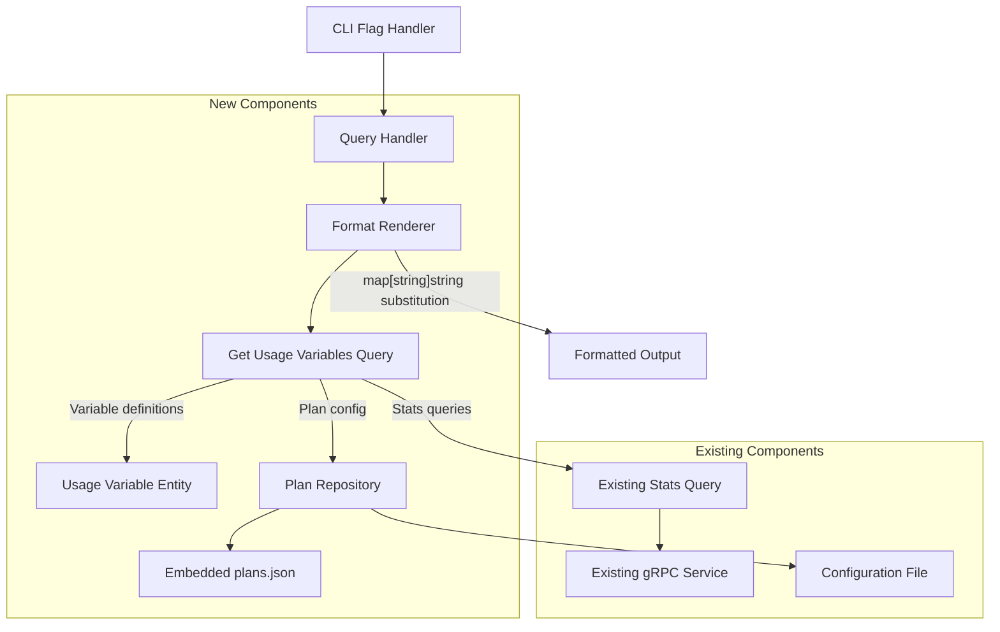

# Quick Query System Design Document

## Feature Overview
The quick query feature enables Claude Code users to retrieve usage information via command-line interface without opening the full TUI dashboard. Users can query metrics like daily/monthly costs and plan usage percentages using simple format strings with predefined variables, making it ideal for integration with status bars, tmux panels, and shell scripts.

## Design Summary
The design follows a simplified approach where:
- **GetUsageVariablesQuery** is the single query interface that retrieves all usage variables
- **UsageVariable** entity defines all supported variables in the business logic layer
- **Plan** entity (already exists) provides percentage calculation logic
- **FormatRenderer** performs simple string substitution using the variable map
- No intermediate abstractions - direct use of existing repositories and queries

## Architecture Planning

### File Structure
```
entity/
  plan.go                    # Plan configuration value object
  usage_variable.go          # Variable definitions for business logic
handler/
  cli/
    format_renderer.go       # Format string rendering with variable substitution
    query_handler.go         # CLI query command handler
repository/
  embedded_plan_repository.go # Plan repository with embedded JSON data
usecase/
  get_usage_variables_query.go # Retrieves usage variables for substitution
data/
  plans.json                # Embedded plan definitions (go:embed)
```

### System Architecture Diagram


### Key Architectural Features
- **Single Responsibility**: Format rendering separated from data retrieval and business logic
- **Simplified Design**: Single query interface (GetUsageVariablesQuery) handles all variable generation
- **Business Logic in Entities**: Variable definitions centralized in entity layer for consistency
- **Direct Dependencies**: No unnecessary abstraction layers, uses PlanRepository directly
- **Embedded Data**: Plan definitions stored in embedded JSON file using go:embed for maintainability
- **Reuse Existing Infrastructure**: Leverages existing gRPC query service and configuration system
- **Error Handling**: Graceful degradation with "❌ ERROR" output on failures

## Interface Contracts

### Components

**Business Logic Components**: Plain Objects without dependencies, relying on dependency injection for infrastructure needs. Include objects, methods, interface contracts that implement business rules and user features.

**Plan Entity** (`entity/plan.go`) - Already exists:
```go
type Plan struct {
    name  string
    price cost.Cost
}

func NewPlan(name string, price Cost) Plan
func (p Plan) Name() string
func (p Plan) Price() cost.Cost
func (p Plan) IsValid() bool
func (p Plan) CalculateUsagePercentage(actualCost cost.Cost) int
```

**Usage Variable Entity** (`entity/usage_variable.go`):
```go
type UsageVariable struct {
    name string
    key  string
}

// Predefined variables
var (
    DailyCostVariable        = UsageVariable{name: "Daily Cost", key: "@daily_cost"}
    MonthlyCostVariable      = UsageVariable{name: "Monthly Cost", key: "@monthly_cost"}
    DailyPlanUsageVariable   = UsageVariable{name: "Daily Plan Usage", key: "@daily_plan_usage"}
    MonthlyPlanUsageVariable = UsageVariable{name: "Monthly Plan Usage", key: "@monthly_plan_usage"}
)

func GetAllUsageVariables() []UsageVariable
func (v UsageVariable) Key() string
func (v UsageVariable) Name() string
```

**Get Usage Variables Query** (`usecase/get_usage_variables_query.go`):
```go
type GetUsageVariablesQuery struct {
    statsQuery      *CalculateStatsQuery
    planRepository  PlanRepository
    periodFactory   PeriodFactory
}

func NewGetUsageVariablesQuery(
    statsQuery *CalculateStatsQuery,
    planRepository PlanRepository,
    periodFactory PeriodFactory,
) *GetUsageVariablesQuery

// Execute retrieves usage variables as a substitution map
func (q *GetUsageVariablesQuery) Execute(ctx context.Context) (map[string]string, error)

// Internal helper for generating the variable map
func (q *GetUsageVariablesQuery) generateVariableMap(
    plan entity.Plan,
    dailyStats entity.Stats,
    monthlyStats entity.Stats,
) map[string]string

type PlanRepository interface {
    GetConfiguredPlan() (entity.Plan, error)
}

type PeriodFactory interface {
    CreateDaily() entity.Period
    CreateMonthly() entity.Period
}
```

**Infrastructure Components**: Database connections, external APIs, UI frameworks, and third-party services that need modification or addition. Use TODO markers for implementation flexibility while describing expected behavior and integration points.

**Format Renderer** (`handler/cli/format_renderer.go`):
```go
type FormatRenderer struct {
    usageVariablesQuery *GetUsageVariablesQuery
}

func NewFormatRenderer(usageVariablesQuery *GetUsageVariablesQuery) *FormatRenderer

func (r *FormatRenderer) Render(formatString string) (string, error)
func (r *FormatRenderer) substituteVariables(input string, variableMap map[string]string) string

// Uses variable map from GetUsageVariablesQuery for substitution
// Handles error cases by returning "❌ ERROR"
```

**Query Handler** (`handler/cli/query_handler.go`):
```go
type QueryHandler struct {
    renderer *FormatRenderer
}

func NewQueryHandler(renderer *FormatRenderer) *QueryHandler
func (h *QueryHandler) HandleFormatQuery(formatString string) error
func (h *QueryHandler) outputResult(result string, err error)

// Error handling:
// - Connection errors -> "❌ ERROR"
// - Invalid format -> "❌ ERROR"  
// - Missing plan config -> use 0% for percentages
```

**Plans Data Structure** (`data/plans.json`):
```json
{
  "plans": {
    "unset": {
      "name": "unset",
      "price": 0.0
    },
    "pro": {
      "name": "pro", 
      "price": 20.0
    },
    "max": {
      "name": "max",
      "price": 100.0
    },
    "max20": {
      "name": "max20",
      "price": 200.0
    }
  }
}
```

**Main.go Integration**:
```go
// In main.go, add to existing flag handling:
if formatString != "" {
    // Create dependencies
    usageVariablesQuery := usecase.NewGetUsageVariablesQuery(
        statsQuery,
        planRepository,
        periodFactory,
    )
    renderer := cli.NewFormatRenderer(usageVariablesQuery)
    handler := cli.NewQueryHandler(renderer)
    
    // Execute query
    if err := handler.HandleFormatQuery(formatString); err != nil {
        os.Exit(1)
    }
    return
}

// Existing dataFS for plan repository:
//go:embed data/*
var dataFS embed.FS
```

**Plan Repository Implementation** (`repository/embedded_plan_repository.go`):
```go
package repository

import (
    "embed"
    "encoding/json"
    "fmt"
)

type EmbeddedPlanRepository struct {
    config *Config  // Direct Config injection
    dataFS embed.FS
    plans  map[string]PlanData
}

type PlanData struct {
    Name  string  `json:"name"`
    Price float64 `json:"price"`
}

type PlansDocument struct {
    Plans map[string]PlanData `json:"plans"`
}

func NewEmbeddedPlanRepository(config *Config, dataFS embed.FS) (*EmbeddedPlanRepository, error) {
    plansData, err := dataFS.ReadFile("data/plans.json")
    if err != nil {
        return nil, fmt.Errorf("failed to read plans.json: %w", err)
    }
    
    var doc PlansDocument
    if err := json.Unmarshal(plansData, &doc); err != nil {
        return nil, fmt.Errorf("failed to unmarshal plans data: %w", err)
    }
    
    return &EmbeddedPlanRepository{
        config: config,
        dataFS: dataFS,
        plans:  doc.Plans,
    }, nil
}

func (r *EmbeddedPlanRepository) GetConfiguredPlan() (entity.Plan, error) {
    planName := r.config.Claude.Plan
    if planName == "" {
        planName = "unset"
    }
    
    planData, exists := r.plans[planName]
    if !exists {
        // Return unset plan for invalid configurations
        planData = r.plans["unset"]
    }
    
    return entity.NewPlan(planData.Name, cost.NewCost(planData.Price)), nil
}
```

## Technical Details

### Development Environment Requirements
- Go 1.24.3+ (existing requirement)
- Access to existing gRPC query service
- Configuration file access for plan settings

### Dependencies
- Existing entity types (Cost, Period, Stats)
- Existing usecase (CalculateStatsQuery)
- Existing gRPC client infrastructure
- Existing Config struct with Claude.Plan field
- Go embed package for data file embedding

### Configuration Files
Extend existing `config.toml`:
```toml
[claude]
plan = "pro"  # Options: "unset", "pro", "max", "max20"
```

### Testing Strategy
- Unit tests for UsageVariable entity definitions
- Unit tests for GetUsageVariablesQuery with mock repositories
- Unit tests for FormatRenderer variable substitution
- Unit tests for percentage calculations with different plans
- Integration tests with mock gRPC responses
- CLI integration tests for error scenarios

### Deployment Considerations
- Extend existing CLI flag parsing in main.go
- Add `-format` flag handler that creates and uses QueryHandler
- Pass existing Config instance to PlanRepository via dependency injection
- Ensure graceful error handling for network connectivity issues
- Maintain backward compatibility with existing CLI flags
- Plans data embedded in binary at compile time via go:embed
- Follow existing dependency injection pattern for Config and dataFS