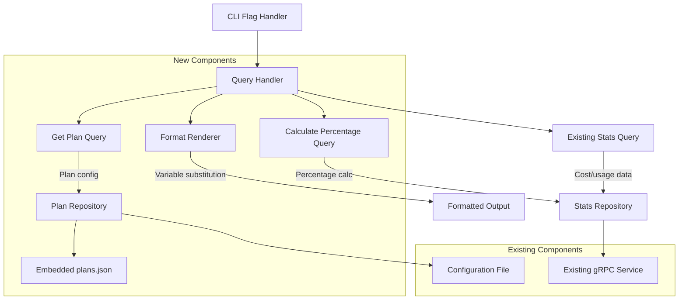

# Quick Query System Design Document

## Feature Overview
The quick query feature enables Claude Code users to retrieve usage information via command-line interface without opening the full TUI dashboard. Users can query metrics like daily/monthly costs and plan usage percentages using simple format strings with predefined variables, making it ideal for integration with status bars, tmux panels, and shell scripts.

## Architecture Planning

### File Structure
```
entity/
  plan.go                    # Plan configuration value object
handler/
  cli/
    format_renderer.go       # Format string rendering with variable substitution
    query_handler.go         # CLI query command handler
repository/
  embedded_plan_repository.go # Plan repository with embedded JSON data
usecase/
  get_plan_query.go         # Plan configuration business logic
  calculate_percentage_query.go # Plan usage percentage calculations
data/
  plans.json                # Embedded plan definitions (go:embed)
```

### System Architecture Diagram


### Key Architectural Features
- **Single Responsibility**: Format rendering separated from data retrieval and business logic
- **Dependency Injection**: Business logic components receive infrastructure dependencies
- **Clean Architecture**: Domain entities for Plan, handlers for CLI, usecases for business rules
- **Embedded Data**: Plan definitions stored in embedded JSON file using go:embed for maintainability
- **Reuse Existing Infrastructure**: Leverages existing gRPC query service and configuration system
- **Error Handling**: Graceful degradation with "❌ ERROR" output on failures

## Interface Contracts

### Components

**Business Logic Components**: Plain Objects without dependencies, relying on dependency injection for infrastructure needs. Include objects, methods, interface contracts that implement business rules and user features.

**Plan Entity** (`entity/plan.go`):
```go
type Plan struct {
    name  string
    price cost.Cost
}

func NewPlan(name string) Plan
func (p Plan) Name() string
func (p Plan) Price() cost.Cost
func (p Plan) IsValid() bool
func (p Plan) CalculateUsagePercentage(actualCost cost.Cost) int
```

**Get Plan Query** (`usecase/get_plan_query.go`):
```go
type GetPlanQuery struct {
    planRepository PlanRepository
}

func NewGetPlanQuery(planRepo PlanRepository) *GetPlanQuery
func (q *GetPlanQuery) Execute() (entity.Plan, error)

type PlanRepository interface {
    GetConfiguredPlan() (entity.Plan, error)
}
```

**Calculate Percentage Query** (`usecase/calculate_percentage_query.go`):
```go
type CalculatePercentageQuery struct {
    planQuery     *GetPlanQuery
    statsQuery    *CalculateStatsQuery
    periodFactory PeriodFactory
}

func NewCalculatePercentageQuery(
    planQuery *GetPlanQuery,
    statsQuery *CalculateStatsQuery,
    periodFactory PeriodFactory,
) *CalculatePercentageQuery

func (q *CalculatePercentageQuery) ExecuteDaily() (int, error)
func (q *CalculatePercentageQuery) ExecuteMonthly() (int, error)

type PeriodFactory interface {
    CreateDaily() entity.Period
    CreateMonthly() entity.Period
}
```

**Infrastructure Components**: Database connections, external APIs, UI frameworks, and third-party services that need modification or addition. Use TODO markers for implementation flexibility while describing expected behavior and integration points.

**Format Renderer** (`handler/cli/format_renderer.go`):
```go
type FormatRenderer struct {
    statsQuery      *CalculateStatsQuery
    percentageQuery *CalculatePercentageQuery
    periodFactory   PeriodFactory
}

func NewFormatRenderer(
    statsQuery *CalculateStatsQuery,
    percentageQuery *CalculatePercentageQuery,
    periodFactory PeriodFactory,
) *FormatRenderer

func (r *FormatRenderer) Render(formatString string) (string, error)
func (r *FormatRenderer) substituteVariables(input string) (string, error)

// Variable substitution map:
// @daily_cost -> daily cost in USD format ($10.0)
// @monthly_cost -> monthly cost in USD format ($150.0)  
// @daily_plan_usage -> daily usage percentage (50%)
// @monthly_plan_usage -> monthly usage percentage (75%)
```

**Query Handler** (`handler/cli/query_handler.go`):
```go
type QueryHandler struct {
    renderer *FormatRenderer
}

func NewQueryHandler(renderer *FormatRenderer) *QueryHandler
func (h *QueryHandler) HandleFormatQuery(formatString string) error
func (h *QueryHandler) outputResult(result string, err error)

// Error handling:
// - Connection errors -> "❌ ERROR"
// - Invalid format -> "❌ ERROR"  
// - Missing plan config -> use 0% for percentages
```

**Plans Data Structure** (`data/plans.json`):
```json
{
  "plans": {
    "unset": {
      "name": "unset",
      "price": 0.0
    },
    "pro": {
      "name": "pro", 
      "price": 20.0
    },
    "max": {
      "name": "max",
      "price": 100.0
    },
    "max20": {
      "name": "max20",
      "price": 200.0
    }
  }
}
```

**Main.go Embedding**:
```go
package main

import (
    "embed"
)

//go:embed data/*
var dataFS embed.FS

// Pass dataFS to repository via dependency injection
```

**Plan Repository Implementation** (`repository/embedded_plan_repository.go`):
```go
package repository

import (
    "embed"
    "encoding/json"
    "fmt"
)

type EmbeddedPlanRepository struct {
    configReader ConfigReader
    dataFS       embed.FS
    plans        map[string]PlanData
}

type PlanData struct {
    Name  string  `json:"name"`
    Price float64 `json:"price"`
}

type PlansDocument struct {
    Plans map[string]PlanData `json:"plans"`
}

type ConfigReader interface {
    GetClaudePlan() string
}

func NewEmbeddedPlanRepository(configReader ConfigReader, dataFS embed.FS) (*EmbeddedPlanRepository, error) {
    plansData, err := dataFS.ReadFile("data/plans.json")
    if err != nil {
        return nil, fmt.Errorf("failed to read plans.json: %w", err)
    }
    
    var doc PlansDocument
    if err := json.Unmarshal(plansData, &doc); err != nil {
        return nil, fmt.Errorf("failed to unmarshal plans data: %w", err)
    }
    
    return &EmbeddedPlanRepository{
        configReader: configReader,
        dataFS:       dataFS,
        plans:        doc.Plans,
    }, nil
}

func (r *EmbeddedPlanRepository) GetConfiguredPlan() (entity.Plan, error) {
    planName := r.configReader.GetClaudePlan()
    if planName == "" {
        planName = "unset"
    }
    
    planData, exists := r.plans[planName]
    if !exists {
        // Return unset plan for invalid configurations
        planData = r.plans["unset"]
    }
    
    return entity.NewPlan(planData.Name, cost.NewCost(planData.Price)), nil
}
```

## Technical Details

### Development Environment Requirements
- Go 1.24.3+ (existing requirement)
- Access to existing gRPC query service
- Configuration file access for plan settings

### Dependencies
- Existing entity types (Cost, Period, Stats)
- Existing usecase (CalculateStatsQuery)
- Existing gRPC client infrastructure
- Existing configuration system
- Go embed package for data file embedding

### Configuration Files
Extend existing `config.toml`:
```toml
[claude]
plan = "pro"  # Options: "unset", "pro", "max", "max20"
```

### Testing Strategy
- Unit tests for Plan entity business rules
- Unit tests for format variable substitution
- Unit tests for percentage calculations with different plans
- Integration tests with mock gRPC responses
- CLI integration tests for error scenarios

### Deployment Considerations
- Extend existing CLI flag parsing in main.go
- Add `-format` flag handler that creates and uses QueryHandler
- Ensure graceful error handling for network connectivity issues
- Maintain backward compatibility with existing CLI flags
- Plans data embedded in binary at compile time via go:embed
- Dependency injection pattern for dataFS from main.go to repository layer