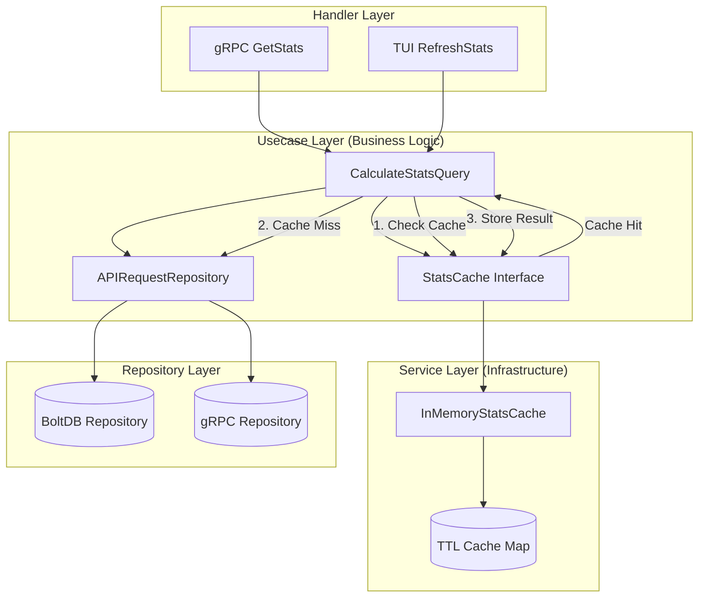

# Stats In-Memory Cache System Design Document

## Feature Overview
Add simple in-memory caching mechanism for stats queries to improve response time and reduce CPU usage. The cache provides 1-minute TTL-based storage for calculated `entity.Stats` results, injected into `CalculateStatsQuery` use case via dependency injection to maintain Clean Architecture principles.

## Architecture Planning

### File Structure
```
usecase/
├── stats_cache.go                    # New: StatsCache interface definition
service/
├── in_memory_stats_cache.go         # New: In-memory TTL cache implementation
config.go                            # Modified: Add cache configuration
config.toml.example                  # Modified: Add cache config example
usecase/calculate_stats_query.go     # Modified: Inject and use StatsCache
main.go                              # Modified: Wire cache service
```

### System Architecture Diagram


### Key Architectural Features
- **Use Case Injection**: StatsCache interface injected into CalculateStatsQuery via DI
- **TTL-Based Expiration**: Configurable cache duration with lazy cleanup
- **Thread-Safe Design**: RWMutex for concurrent gRPC access
- **Lazy Cleanup**: Cleanup triggered on Get/Set operations, max one cleanup goroutine
- **Clean Architecture Compliance**: Cache interface in use case, implementation in service layer
- **Cache-First Strategy**: Check cache before expensive repository operations
- **Configuration-Driven**: Enable/disable and TTL control via existing config system

## Interface Contracts

### Business Logic Components

#### **StatsCache Interface** (New - in usecase/)
Interface defining contract for stats caching, injected into CalculateStatsQuery.

```go
type StatsCache interface {
    Get(period entity.Period) *entity.Stats
    Set(period entity.Period, stats *entity.Stats)
}

// Optional: NoOpStatsCache for when caching is disabled
type NoOpStatsCache struct{}

func (c *NoOpStatsCache) Get(period entity.Period) *entity.Stats { return nil }
func (c *NoOpStatsCache) Set(period entity.Period, stats *entity.Stats) {}
```

#### **CalculateStatsQuery Enhancement** (Modified)
Inject StatsCache interface and implement cache-first query strategy.

```go
type CalculateStatsQuery struct {
    repository APIRequestRepository
    cache      StatsCache  // New dependency injection
}

func NewCalculateStatsQuery(repository APIRequestRepository, cache StatsCache) *CalculateStatsQuery {
    return &CalculateStatsQuery{
        repository: repository,
        cache:      cache,
    }
}

func (q *CalculateStatsQuery) Execute(ctx context.Context, params CalculateStatsParams) (entity.Stats, error) {
    // 1. Check cache first
    if cachedStats := q.cache.Get(params.Period); cachedStats != nil {
        return *cachedStats, nil
    }
    
    // 2. Cache miss, execute original calculation logic
    requests, err := q.repository.FindByPeriodWithLimit(params.Period, 0, 0)
    if err != nil {
        return entity.Stats{}, err
    }
    
    stats := q.calculateStats(requests) // Original aggregation logic
    
    // 3. Store result in cache
    q.cache.Set(params.Period, &stats)
    
    return stats, nil
}
```

### Infrastructure Components

#### **InMemoryStatsCache** (New - in service/)
TTL-based in-memory cache implementation with lazy cleanup mechanism.

```go
type InMemoryStatsCache struct {
    cache         map[string]*CachedStats
    mutex         sync.RWMutex
    ttl           time.Duration
    enabled       bool
    cleanupRunning int32  // atomic flag for cleanup goroutine
}

type CachedStats struct {
    Stats     *entity.Stats
    ExpiresAt time.Time
}

func NewInMemoryStatsCache(ttl time.Duration) *InMemoryStatsCache
func (c *InMemoryStatsCache) Get(period entity.Period) *entity.Stats
func (c *InMemoryStatsCache) Set(period entity.Period, stats *entity.Stats)
func (c *InMemoryStatsCache) generateKey(period entity.Period) string
func (c *InMemoryStatsCache) tryCleanupExpired()
func (c *InMemoryStatsCache) cleanupExpired()
```

**Key Features:**
- Cache key format: `{PeriodStart}_{PeriodEnd}` (Unix timestamps)  
- Lazy cleanup triggered on Get/Set operations
- Atomic flag ensures maximum one cleanup goroutine at a time
- Thread-safe concurrent access
- Disabled cache returns nil for all Get() calls
- No background goroutines or cleanup channels needed

#### **Configuration Extension** (Modified)
Extend existing Server configuration with cache settings.

```go
// In config.go Server struct
type Server struct {
    // ... existing fields
    Cache ServerCache `mapstructure:"cache"`
}

type ServerCache struct {
    Stats CacheStats `mapstructure:"stats"`
}

type CacheStats struct {
    Enabled bool   `mapstructure:"enabled"`
    TTL     string `mapstructure:"ttl"`
}
```

**Default Values:**
- `server.cache.stats.enabled = true`
- `server.cache.stats.ttl = "1m"`

## Technical Details

### Development Environment Requirements
- Go 1.21+ (existing requirement)
- No additional dependencies required

### Dependencies
- Uses existing project dependencies:
  - `sync` package for RWMutex and channels
  - `time` package for TTL management
  - Existing `entity` and `usecase` packages

### Configuration Files
Add cache configuration to `config.toml.example`:

```toml
[server.cache.stats]
enabled = true
ttl = "1m"  # Format: "1m", "30s", "2m30s"
```

**CLI Flag Support:**
```bash
./ccmon -s --server-cache-stats-enabled=true --server-cache-stats-ttl=1m
```

### Testing Strategy
Focus on validating user acceptance criteria and cache behavior:

1. **Cache Hit/Miss Behavior**:
   - Test identical period queries return cached results
   - Verify cache miss triggers repository and calculation
   - Validate cache key generation for different periods

2. **TTL Expiration**:
   - Test cached results expire after configured TTL
   - Verify lazy cleanup removes expired entries on Get/Set
   - Test queries after expiration recalculate and cache new results

3. **Configuration Testing**:
   - Test cache enable/disable functionality via NoOpStatsCache
   - Verify TTL parsing from configuration
   - Test default values are applied correctly

4. **Use Case Integration Testing**:
   - Test CalculateStatsQuery with cache enabled/disabled
   - Verify cache is populated after first query
   - Test concurrent access to cached stats

5. **End-to-End Testing**:
   - Test gRPC service receives cached results
   - Verify TUI still receives real-time updates
   - Test server startup with cache configuration

### Deployment Considerations
- **Memory Usage**: Cache size limited by 1-minute TTL and query frequency
- **Performance Impact**: Minimal overhead with lazy cleanup on demand
- **Configuration Migration**: Backward compatible - uses NoOpStatsCache if config missing
- **No Goroutine Management**: Simplified architecture without persistent cleanup goroutines
- **Dependency Injection**: Easy to swap cache implementations or disable entirely

**Cache Memory Estimation:**
- Each cached Stats object: ~200 bytes
- With 1-minute TTL and frequent queries: <10MB typical usage
- Automatic cleanup prevents unbounded growth