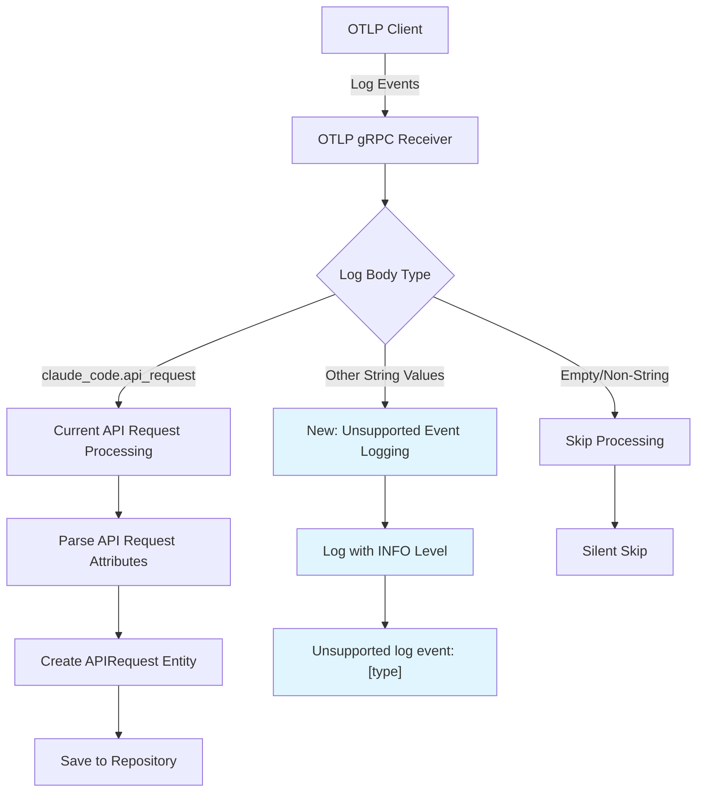

# Unsupported Event Logging System Design Document

## Feature Overview
Add logging capability for non-API request OTLP log events to identify potential new event types for future ccmon features. This enhancement provides visibility into unsupported events without affecting current API request processing, enabling data-driven decisions about feature expansion.

## Architecture Planning

### File Structure
```
handler/grpc/receiver/
├── receiver.go              # Modify: Add unsupported event logging to existing logsReceiver.Export()
└── receiver_test.go         # Modify: Add tests for unsupported event logging scenarios
```

### System Architecture Diagram


### Key Architectural Features
- **Minimal Change Principle**: Extends existing OTLP receiver without architectural changes
- **Non-Intrusive Logging**: Logs unsupported events without affecting API request processing
- **Clean Separation**: Maintains clear distinction between supported and unsupported event handling
- **Zero Performance Impact**: Minimal overhead for discovery logging

## Interface Contracts

### Infrastructure Components

**OTLP Receiver Enhancement** (handler/grpc/receiver/receiver.go):
```go
// TODO: Extend logsReceiver.Export() method to add unsupported event logging
// Current flow:
// 1. Check if log record has string body value
// 2. If body == "claude_code.api_request" -> process as API request (existing)
// 3. If body is non-empty string && body != "claude_code.api_request" -> log as unsupported
// 4. If body is empty/nil/non-string -> skip silently (existing behavior)

// New logging behavior:
// log.Printf("Unsupported log event: %s", bodyValue)
```

**Test Coverage Enhancement** (handler/grpc/receiver/receiver_test.go):
```go
// TODO: Add test cases for unsupported event logging scenarios:
// - Test logging of various unsupported string event types
// - Test skipping of empty/nil body values
// - Test skipping of non-string body values
// - Verify correct log format output
```

## Technical Details

### Development Environment Requirements
- Go development environment (existing)
- Access to Go's standard `log` package (already in use)

### Dependencies
- No new dependencies required
- Uses existing OTLP and gRPC infrastructure
- Leverages current logging infrastructure

### Configuration Files
- No configuration changes required
- Uses existing server mode configuration

### Testing Strategy
- **Unit Tests**: Test unsupported event logging with various input scenarios
- **Integration Tests**: Verify logging behavior in OTLP receiver context
- **Log Validation**: Confirm correct log format and INFO level output
- **Backward Compatibility**: Ensure existing API request processing remains unchanged

### Deployment Considerations
- **Zero Downtime**: Enhancement is additive, no breaking changes
- **Log Monitoring**: Operators can monitor INFO logs to discover new event types
- **Resource Impact**: Minimal CPU/memory overhead from additional logging
- **Log Rotation**: Leverage existing log management practices for INFO level logs